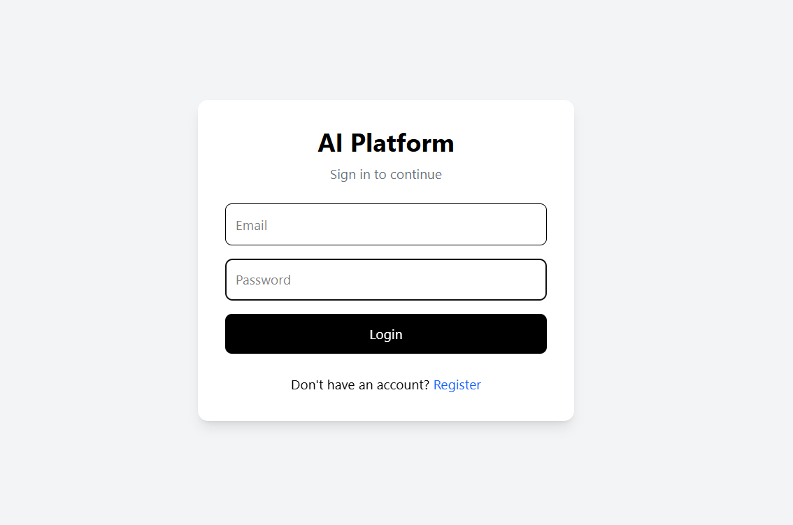

# Multi-Agent Software Engineering Platform

## Overview

The Multi-Agent Software Engineering Platform is a full-stack AI-powered application that automates parts of the software development lifecycle using multiple autonomous AI agents.

The platform allows users to:

* Register and authenticate securely using JWT
* Create and manage software projects
* Define software requirements
* Execute AI-powered workflows
* Generate software plans
* Generate implementation strategies
* Review generated solutions
* Track workflow execution results
* Visualize project and workflow statistics

The system follows a multi-agent architecture where specialized AI agents collaborate to analyze requirements, generate solutions, and review outputs.

---

## Features

### Authentication

* User Registration
* User Login
* JWT Authentication
* Protected Routes

### Project Management

* Create Projects
* View Projects
* Manage Project Requirements

### Requirement Management

* Create Requirements
* Track Requirement Status
* Execute AI Workflows

### Multi-Agent Workflow

#### Planner Agent

Responsibilities:

* Analyze requirements
* Create implementation plans
* Break down software modules

#### Coder Agent

Responsibilities:

* Generate implementation strategies
* Suggest code structures
* Design development approach

#### Reviewer Agent

Responsibilities:

* Review generated outputs
* Identify improvements
* Assign review scores

### Dashboard

* Total Projects
* Total Requirements
* Workflow Execution Statistics

### Workflow Persistence

Store and visualize:

* Planner Output
* Coder Output
* Reviewer Output
* Review Score
* Workflow Status

---

## System Architecture


### High-Level Flow

User
→ React Frontend
→ Node.js Backend
→ FastAPI AI Service
→ LangGraph Workflow
→ Planner Agent
→ Coder Agent
→ Reviewer Agent
→ Ollama (Qwen2.5)
→ MongoDB
→ Frontend Visualization

---

## Technology Stack

### Frontend

* React
* React Router DOM
* Axios
* Tailwind CSS
* Vite

### Backend

* Node.js
* Express.js
* MongoDB Atlas
* Mongoose
* JWT
* BcryptJS

### AI Service

* Python
* FastAPI
* LangGraph
* Ollama
* Qwen2.5

### Database

* MongoDB Atlas

---

## Folder Structure

```text
multi-agent-software-engineering-platform
│
├── ai-service
│   ├── agents
│   ├── workflows
│   ├── services
│   ├── models
│   └── app.py
│
├── backend
│   ├── controllers
│   ├── middleware
│   ├── models
│   ├── routes
│   └── server.js
│
├── frontend
│   ├── src
│   │   ├── pages
│   │   ├── layouts
│   │   ├── services
│   │   ├── components
│   │   └── App.jsx
│
├── architecture
│   └── system-design.png
│
├── docs
│
├── screenshots
│
└── README.md
```

---

## AI Workflow

```text
Requirement
      │
      ▼
Planner Agent
      │
      ▼
Coder Agent
      │
      ▼
Reviewer Agent
      │
      ▼
Review Score
      │
      ▼
MongoDB Storage
      │
      ▼
Frontend Visualization
```

---

## Installation

### Clone Repository

```bash
git clone https://github.com/sricharan-reddy1202/multi-agent-software-engineering-platform.git
```

---

## Backend Setup

```bash
cd backend

npm install

npm run dev
```

Create a `.env` file:

```env
PORT=5000

MONGO_URI=YOUR_MONGODB_URI

JWT_SECRET=YOUR_SECRET
```

---

## Frontend Setup

```bash
cd frontend

npm install

npm run dev
```

---

## AI Service Setup

Create a virtual environment:

```bash
cd ai-service

python -m venv venv
```

Activate virtual environment:

### Windows

```bash
venv\Scripts\activate
```

### Linux / Mac

```bash
source venv/bin/activate
```

Install dependencies:

```bash
pip install -r requirements.txt
```

Run FastAPI service:

```bash
uvicorn app:app --reload
```

---

## Ollama Setup

Install Ollama:

https://ollama.com

Pull the model:

```bash
ollama pull qwen2.5:3b
```

Run Ollama:

```bash
ollama serve
```

Verify:

```bash
ollama list
```

---

## API Endpoints

### Authentication

```http
POST /api/auth/register
POST /api/auth/login
```

### Projects

```http
GET    /api/projects
POST   /api/projects
```

### Requirements

```http
GET    /api/projects/:projectId/requirements
POST   /api/projects/:projectId/requirements
```

### Workflow

```http
POST /api/projects/requirements/:id/run-workflow
```

### Dashboard

```http
GET /api/dashboard/stats
```

---

## Screenshots

### Login Page



### Dashboard


### Projects


### Workflow Execution


---

## Future Enhancements

* Real-time workflow updates using WebSockets
* Streaming LLM responses
* Human-in-the-loop approvals
* Multi-model support (OpenAI, Gemini, Claude)
* Agent memory
* Workflow analytics
* Team collaboration features
* Cloud deployment

---

## Key Learnings

Through this project I gained hands-on experience with:

* Full Stack Development
* React Architecture
* REST API Design
* JWT Authentication
* MongoDB Data Modeling
* FastAPI Development
* LangGraph Workflows
* Multi-Agent Systems
* LLM Integration
* AI Application Architecture
* System Design

---

## Author

**Pinreddy Sricharan Reddy**

GitHub:
https://github.com/sricharan-reddy1202
